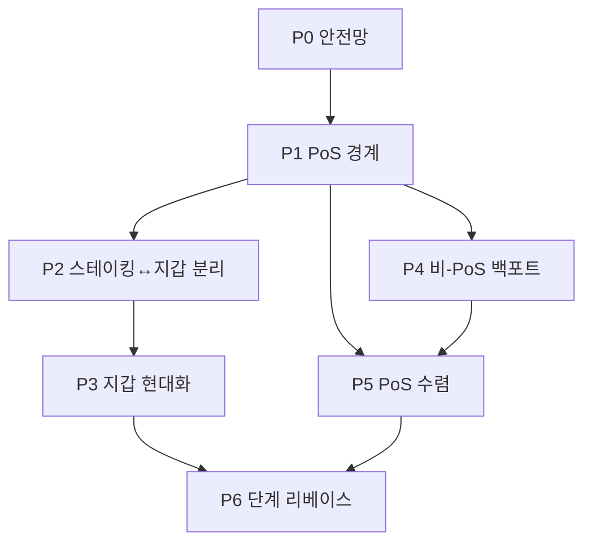

# XPChain 분리 방식 절차 (최종 정리)

**전략 한 줄:** PoS(스테이킹·합의)는 `src/pos/`에 고정하고, 지갑·스크립트·비-PoS 노드 코드는 Bitcoin 쪽을 **단계적으로 이식**한다. 체인·지갑 파일·주소는 유지한다.

---

## 1. 분리가 의미하는 것

| ✅ 하는 것 | ❌ 하지 않는 것 |
|-----------|----------------|
| 코드 역할을 폴더·인터페이스로 나눔 | 체인을 둘로 쪼개지 않음 |
| PoS 검증·스테이킹 규칙을 한곳에 모음 | PoS 제거 |
| 지갑·송금을 Bitcoin 최신 쪽으로 올리기 쉽게 함 | 사용자에게 강제 마이그레이션 요구 (원칙) |
| `xpchaind` / `xpchain-qt`는 그대로 사용 가능 | 기존 `wallet.dat` / 주소 폐기 |

**사용자:** 같은 지갑 파일, 같은 주소로 송금·수신 (호환 정책을 지키는 한).
**개발자:** PoS는 `src/pos/`만, 지갑은 `wallet/` 위주로 작업.

---

## 2. 절대 원칙 (모든 단계 공통)

1. **동작 변경 없는 리팩터 PR**과 **기능 추가 PR**을 분리한다.
2. **기존 BDB·SQLite Legacy HD 지갑**은 계속 연다.
3. **`migratewallet` / descriptor 전환**은 선택 사항으로 둔다.
4. **합의·PoS 변경**은 `src/pos/` + 커뮤니티 합의 후에만 한다.
5. **릴리스 전:** CI green + regtest PoS + 기존 지갑 소액 송금 테스트.
6. **업그레이드 전:** `backupwallet` 또는 데이터 디렉터리 백업.

---

## 3. 전체 절차 (P0 → P6)



---

### P0 — 안전망 (선행 필수)

**목표:** 이후 모든 변경의 회귀를 자동으로 잡는다.

| # | 작업 | 완료 기준 |
|---|------|-----------|
| P0-1 | Functional test CI 실제 실행 (`ENABLE_UTILS` 등) | ✅ `ENABLE_UTILS` wired; wallet + exchange hot-wallet suite in CI |
| P0-2 | PoS unit test | `CheckProofOfStake`, `CheckStakeKernelHash`, `GetProofOfStakeReward`, `IsCoinStakeTx` |
| P0-3 | 합의 파라미터 문서 | `nSwitchHeight`, stake age, `TaprootHeight`, 보상 공식 |
| P0-4 | regtest PoS 시나리오 | 동기화 → 스테이킹 → 보상 → immature 자동 검증 |

**산출물:** CI + PoS 회귀 테스트가 항상 돌아가는 상태.

---

### P1 — PoS 경계 고정 (동작 동일)

**목표:** PoS 코드 위치를 고정한다. **사용자·체인 동작 변화 없음.**

| # | 작업 | 대상 파일(현재) |
|---|------|----------------|
| P1-1 | `src/pos/` 디렉터리 설계 | `pos/kernel.h`, `pos/stake.h`, `pos/reward.h`, `pos/height.h` |
| P1-2 | 저위험 코드 이동 | `kernel.cpp` → `pos/kernel.cpp`, `policy/stake.cpp` → `pos/stake_policy.cpp` |
| P1-3 | 보상·높이 함수 추출 | `validation.cpp`의 `IsPoSHeight`, `GetProofOfStakeReward` 등 |
| P1-4 | validation 훅 도입 | `ConnectBlock` 등에서 `pos::ConnectBlock(...)` 호출로 수렴 |
| P1-5 | `doc/ARCHITECTURE.md` | "합의 영역 / 비합의 영역" 목록 |

**완료 기준:** 블록 해시·검증·스테이킹 결과가 분리 전과 **완전 동일**.

---

### P2 — 스테이킹 ↔ 지갑 인터페이스 분리

**목표:** `miner`가 `CWallet` 구체 클래스에 직접 묶이지 않게 한다.

| # | 작업 | 내용 |
|---|------|------|
| P2-1 | `IStakeableWallet` (가칭) 정의 | UTXO 나열, `CreateCoinStake`, 서명 |
| P2-2 | `MintStake` / `ThreadStakeMinter` 정리 | `wallet/init` → `pos/staker.cpp` + 인터페이스 |
| P2-3 | GUI 스테이킹 API | `MintingTableModel`이 pos/인터페이스 경유 |
| P2-4 | `-disablewallet` 노드 경로 | 거래소·아카이브 노드 정리 |
| P2-5 | `listmintings` RPC | pos 레이어로 이동 |

**완료 기준:** `miner.cpp`가 `wallet/wallet.h`에 직접 의존하지 않음 (또는 인터페이스만).

---

### P3 — 지갑 현대화 (P2와 병렬 가능)

**목표:** Bitcoin 0.21~0.24 **지갑 체감** 달성. 합의 코드는 최소 변경.

| 우선순위 | 작업 |
|----------|------|
| P3-1 | `importdescriptors`, `listdescriptors`, `deriveaddresses` |
| P3-2 | `createwallet` RPC 기본값 = descriptor, GUI와 통일 |
| P3-3 | `utxoupdatepsbt`, `joinpsbts`, `analyzepsbt` |
| P3-4 | 니모닉 복구 시 descriptor 옵션 (선택) |
| P3-5 | Taproot 지갑 경로 (bech32m 송금·잔돈) |
| P3-6 | GUI 안정성·멀티월렛·온보딩 |
| P3-7 | SQLCipher·migrate·백업 문서 정리 |

**호환:** Legacy HD·BDB 지갑은 **그대로** 송금 가능. 새 기능은 신규/마이그레이션 지갑에 적용.

---

### P4 — 비-PoS 인프라 백포트 (validation 본문 제외)

**목표:** PoS 바깥 레이어만 Bitcoin 0.21 쪽으로 맞춘다.

| 우선순위 | 영역 | 내용 |
|----------|------|------|
| P4-1 | 의존성 | libsecp256k1, OpenSSL, LevelDB CVE |
| P4-2 | `script/` | Taproot interpreter, witness (pos 훅과 연동) |
| P4-3 | `policy/` (stake 제외) | fee, standardness |
| P4-4 | util / crypto | 공통 유틸 |
| P4-5 | test | functional harness 일부 |

**금지:** `validation.cpp` 통째 머지는 **P5 이후**까지 미룸.

---

### P5 — PoS 모듈 수렴 (리베이스 직전)

**목표:** Bitcoin `validation`/`miner` 머지 시 충돌이 `src/pos/`로만 한정되게 한다.

| # | 작업 |
|---|------|
| P5-1 | `ConnectBlock` / `CheckBlock` PoS → `pos/validate.cpp` |
| P5-2 | PoS DAA → `pos/difficulty.cpp` |
| P5-3 | PoS 블록 조립 → `pos/block_assembler.cpp` |
| P5-4 | XP 전용 소프트포크 문서·테스트 (`check_dup_txin`, 블록 서명 등) |
| P5-5 | **TaprootHeight** 메인넷 활성 정책 결정·공지 |

**완료 기준:** Bitcoin 0.21 `validation.cpp` import 시 수정 파일이 `pos/*` + 소수 훅.

---

### P6 — 단계 리베이스

**목표:** 노드·P2P·mempool을 최신에 가깝게. **한 번에 한 마이너 버전.**

| 단계 | 범위 |
|------|------|
| **6a** | 0.17 → **0.21** (script, wallet, RPC, test) |
| **6b** | 0.21 → **0.25** (mempool, fee, addrman 일부) |
| **6c** | 0.25+ (external signer, 코인선택, assumeUTXO 등) |

**각 단계 릴리스 전 체크:**
- testnet/regtest 전체 동기화
- PoS 블록 생성·검증
- 기존 BDB/SQLite 지갑 open → 소액 송금
- 스테이킹(해당 시)
- 릴리스 노트에 "지갑 파일 형식 변경 없음" 명시 (해당 시)

---

## 4. 마일스톤

| 마일스톤 | 포함 단계 | 완료 정의 |
|----------|-----------|-----------|
| **M1: Safe Base** | P0 | CI + PoS unit/regtest green |
| **M2: PoS Boundary** | P1 | `src/pos/` 존재, 동작 동일 |
| **M3: Wallet Decouple** | P2 | miner ↔ wallet 인터페이스 분리 |
| **M4: Wallet Parity** | P3 핵심 | descriptor + PSBT + Taproot(testnet) |
| **M5: Merge Ready** | P4-2 + P5 | 0.21 validation 머지 충돌 예측 가능 |
| **M6: Node 0.21** | P6a | testnet 장기 운영 후 메인넷 |

---

## 5. 권장 실행 순서 (타임라인 없이)

```
1. P0 전체
2. P1 전체 (동작 동일 리팩터만)
3. P2 + P3-1·P3-3 병렬
4. P3 나머지 + P4-1·P4-2
5. P5
6. P6a → 검증 후 P6b …
```

**첫 3스프린트 예시:**

| 스프린트 | 내용 |
|----------|------|
| 1 | P0 + P1-1~2 (`kernel`/`stake` 이동) |
| 2 | P1-3~4 (validation 훅) + P3-1 (descriptor RPC) |
| 3 | P2 (스테이킹 인터페이스) + P3-3 (PSBT 3종) |

---

## 6. 기존 지갑 호환 (릴리스 정책)

| 항목 | 정책 |
|------|------|
| BDB `wallet.dat` | 계속 지원 (폐지 시 별도 메이저 릴리스·공지) |
| SQLite Legacy HD | 계속 지원 |
| 주소·시드 | 변경 없음 (같은 파일 = 같은 주소) |
| `migratewallet` | 선택 |
| descriptor | 신규 지갑 기본, 기존 지갑 강제 전환 없음 |
| 분리 릴리스 | "지갑 파일 형식 변경 없음" 원칙 |

**업그레이드 후 사용자 체크 (권장):**
`getwalletinfo` → 잔액 확인 → 소액 송금 → (스테이킹 사용 시) immature 여부 확인.

---

## 7. 하지 말아야 할 것

- P1·P5 없이 `validation.cpp` 통째 Bitcoin 머지
- 분리 PR과 기능 PR 한꺼번에 섞기
- BDB 지원 제거를 분리와 동시에 진행
- 메인넷 Taproot 활성을 지갑·스크립트 준비 전에 단독 진행
- functional test 없이 메인넷 릴리스
- "분리 = 새 체인"으로 오해할 만한 사용자 마이그레이션 강제

---

## 8. 성공 기준 (최종)

**기술**
- PoS 로직이 `src/pos/` + validation 얇은 훅에만 존재
- 지갑·PSBT·descriptor를 Bitcoin 0.21+ 수준으로 확장 가능
- 기존 지갑 functional test + regtest PoS CI 상시 green

**제품**
- 기존 사용자: 같은 지갑으로 송금·수신
- 신규 사용자: descriptor + SQLite(±SQLCipher) 기본
- 거래소: `-disablewallet` / `-minting=0` 노드 운영 가능

**장기**
- Bitcoin 0.21 → 0.25+ **단계 리베이스** 경로가 열려 있음

---

## 9. 한 페이지 요약

| 단계 | 한 줄 |
|------|--------|
| **P0** | 테스트·CI·합의 문서 |
| **P1** | PoS를 `src/pos/`로 모음 (동작 동일) |
| **P2** | 스테이킹과 지갑 연결을 인터페이스로 |
| **P3** | descriptor·PSBT·Taproot 지갑 |
| **P4** | script·deps 등 비-PoS 백포트 |
| **P5** | PoS 전부 pos로 수렴 → 머지 준비 |
| **P6** | Bitcoin 0.21→0.25… 단계 리베이스 |

> **분리 절차의 끝:** XPChain PoS는 유지한 채, 지갑은 최신 Bitcoin에 가깝게, 노드는 단계적으로 따라가고, **기존 지갑은 계속 쓸 수 있는** 상태.
